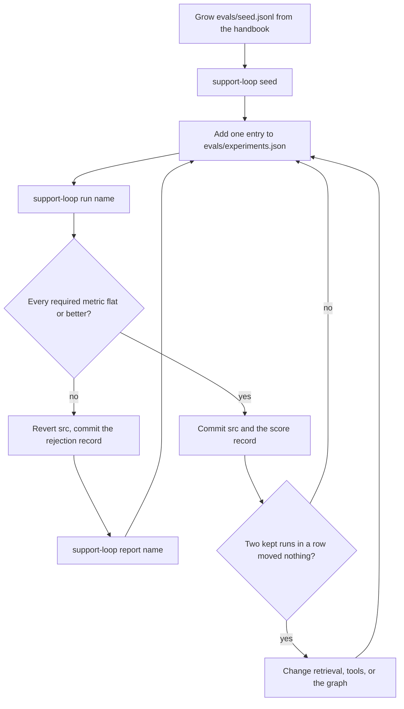
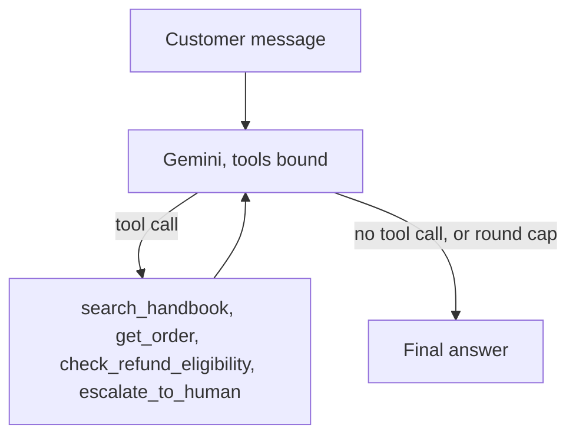

# Loop

```mermaid
flowchart TD
  seed["Grow evals/seed.jsonl from the handbook"] --> push["support-loop seed"]
  push --> write["Add one entry to evals/experiments.json"]
  write --> run["support-loop run name"]
  run --> gate{"Every required metric flat or better?"}
  gate -->|yes| keep["Commit src and the score record"]
  gate -->|no| reject["Revert src, commit the rejection record"]
  reject --> report["support-loop report name"]
  report --> write
  keep --> plateau{"Two kept runs in a row moved nothing?"}
  plateau -->|yes| structural["Change retrieval, tools, or the graph"]
  plateau -->|no| write
  structural --> write
```

# Agent

```mermaid
flowchart TD
  start["Customer message"] --> agent["Gemini, tools bound"]
  agent -->|"tool call"| tools["search_handbook, get_order, check_refund_eligibility, escalate_to_human"]
  tools --> agent
  agent -->|"no tool call, or round cap"| answer["Final answer"]
```

Dates are frozen at 15 October 2026 inside the tools. A later calendar day does not move a golden in or out of a window.
